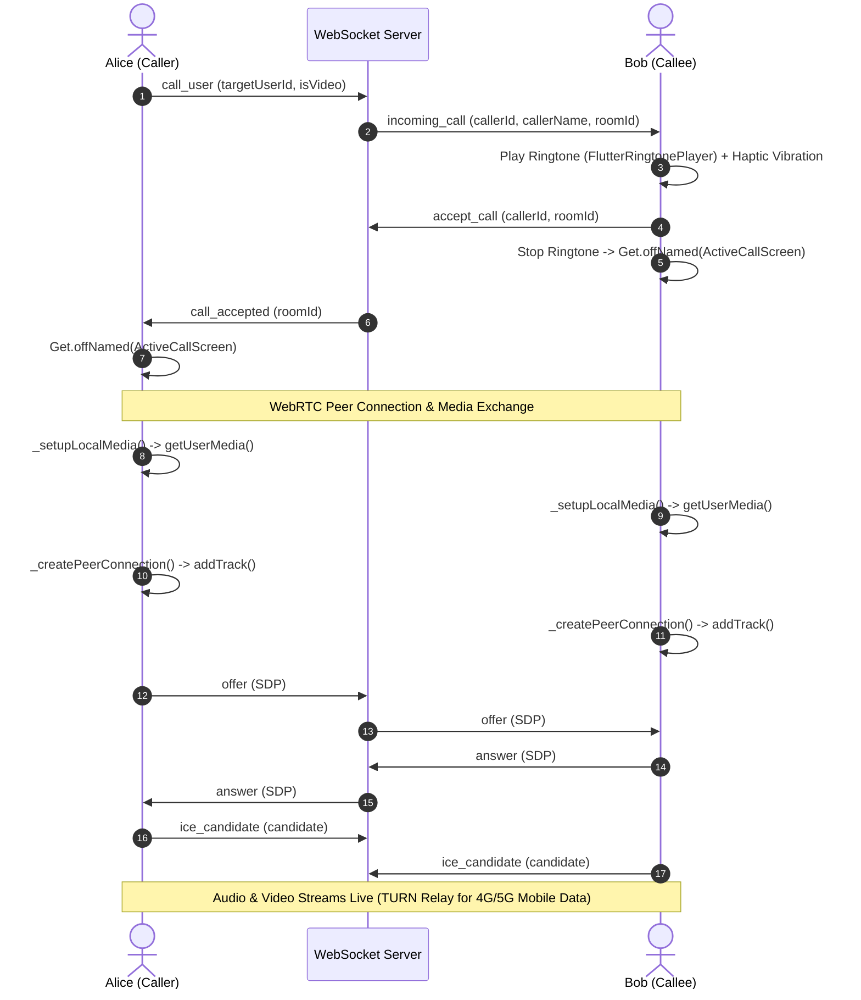

# Comprehensive Flutter WebRTC Audio/Video Calling Documentation

This document provides complete, code-level documentation of the WebRTC audio & video calling implementation in the Flutter application (`webrtcapptest`), covering state management, peer connection setup, dynamic TURN server retrieval, media routing, ringtone feedback, and layout architecture.

---

## 1. Architecture Overview & Call Flow

The Flutter WebRTC feature follows the **GetX Pattern** (Feature-First Architecture).

```
lib/features/call/
├── controllers/
│   └── call_controller.dart         # Main WebRTC logic, RTCPeerConnection, MediaStreams, TURN fetch
├── service/
│   ├── signaling_service.dart      # WebSocket channel communication, heartbeats, auto-reconnect
│   └── foreground_call_service.dart # Android foreground service notification
└── screens/
    ├── active_call_screen.dart     # RTCVideoView UI, PIP local camera, call controls
    ├── incoming_call_screen.dart   # Call acceptance / decline UI
    └── outgoing_call_screen.dart   # Outgoing ringing UI
```

### End-to-End Call Lifecycle Diagram:



---

## 2. Code-Level Implementation in `CallController`

`CallController` (`lib/features/call/controllers/call_controller.dart`) manages all WebRTC peer connections, local and remote video renderers, media streams, and signaling event callbacks.

### 2.1 State Variables & Observables
```dart
class CallController extends GetxController {
  final SignalingService signalingService = SignalingService();

  final webrtc.RTCVideoRenderer localRenderer = webrtc.RTCVideoRenderer();
  final webrtc.RTCVideoRenderer remoteRenderer = webrtc.RTCVideoRenderer();

  webrtc.RTCPeerConnection? _peerConnection;
  webrtc.MediaStream? _localStream;
  webrtc.MediaStream? _remoteStream;

  final List<webrtc.RTCIceCandidate> _remoteIceCandidatesBuffer = [];
  Timer? _vibrationTimer;

  final Rx<CallState> callState = CallState.idle.obs;
  final RxBool isVideoCall = true.obs;
  final RxBool isMuted = false.obs;
  final RxBool isVideoOff = false.obs;
  final RxBool isSpeakerOn = true.obs;
  final RxBool isRemoteVideoReady = false.obs;

  final RxString currentRemoteUserId = ''.obs;
  final RxString currentRemoteName = ''.obs;
  final RxString currentRoomId = ''.obs;
}
```

---

### 2.2 Dynamic TURN & ICE Server Retrieval
To ensure calls work over **Mobile Data (4G/5G CGNAT)**, `fetchIceServers()` fetches live TURN credentials from the backend REST API:

```dart
  Future<void> fetchIceServers() async {
    try {
      final response = await http.get(Uri.parse('${ApiEndpoint.baseUrl}/api/ice-servers'));
      if (response.statusCode == 200) {
        final data = jsonDecode(response.body);
        if (data['iceServers'] != null && data['iceServers'] is List) {
          final List<dynamic> servers = data['iceServers'];
          _iceServers = {
            'iceServers': servers,
            'sdpSemantics': 'unified-plan',
          };
          debugPrint('✅ WebRTC ICE Servers updated from backend (${servers.length} servers)');
        }
      }
    } catch (e) {
      debugPrint('⚠️ Failed to fetch dynamic ICE servers: $e');
    }
  }
```

---

### 2.3 Local Camera & Microphone Initialization (`_setupLocalMedia`)
Captures user camera and mic via `flutter_webrtc` media devices API:

```dart
  Future<void> _setupLocalMedia() async {
    final mediaConstraints = <String, dynamic>{
      'audio': true,
      'video': isVideoCall.value
          ? {'facingMode': 'user'}
          : false,
    };

    _localStream = await webrtc.navigator.mediaDevices.getUserMedia(mediaConstraints);
    localRenderer.srcObject = _localStream;

    Future.delayed(const Duration(milliseconds: 300), () {
      webrtc.Helper.setSpeakerphoneOn(isSpeakerOn.value);
    });
  }
```

---

### 2.4 PeerConnection & Remote Stream Attachment (`_createPeerConnection`)
Creates the `RTCPeerConnection`, registers track listeners, and handles candidate events:

```dart
  Future<void> _createPeerConnection() async {
    _peerConnection = await webrtc.createPeerConnection(_iceServers);

    // Add local media tracks to PeerConnection
    _localStream?.getTracks().forEach((track) {
      _peerConnection?.addTrack(track, _localStream!);
    });

    // Remote Track Listener (Unified Plan)
    _peerConnection?.onTrack = (webrtc.RTCTrackEvent event) async {
      debugPrint('📺 WebRTC onTrack: track.kind=${event.track.kind}');
      event.track.enabled = true;

      if (event.streams.isNotEmpty) {
        _attachRemoteStream(event.streams[0]);
      } else {
        _remoteStream ??= await webrtc.createLocalMediaStream('remote_stream');
        _remoteStream!.addTrack(event.track);
        _attachRemoteStream(_remoteStream!);
      }
    };

    // Candidate Emission
    _peerConnection?.onIceCandidate = (webrtc.RTCIceCandidate candidate) {
      if (candidate.candidate != null && candidate.candidate!.isNotEmpty) {
        signalingService.sendIceCandidate(
          targetUserId: currentRemoteUserId.value,
          candidate: {
            'candidate': candidate.candidate,
            'sdpMid': candidate.sdpMid ?? '0',
            'sdpMLineIndex': candidate.sdpMLineIndex ?? 0,
          },
        );
      }
    };
  }
```

---

### 2.5 Speakerphone Timing & Audio Routing Fix (`_attachRemoteStream`)
When WebRTC initializes audio tracks on Android, the operating system transitions audio mode to `MODE_IN_COMMUNICATION`. Android automatically resets audio routing back to the top earpiece receiver during this OS transition.

To fix silent / low earpiece audio, a **500ms delay** ensures Android completes its transition before forcing speakerphone output:

```dart
  void _attachRemoteStream(webrtc.MediaStream stream) {
    _remoteStream = stream;

    for (var track in stream.getTracks()) {
      track.enabled = true;
    }

    remoteRenderer.srcObject = null;
    remoteRenderer.srcObject = stream;

    // 500ms delayed hardware route to prevent Android MODE_IN_COMMUNICATION override
    Future.delayed(const Duration(milliseconds: 500), () {
      webrtc.Helper.setSpeakerphoneOn(isSpeakerOn.value);
    });

    isRemoteVideoReady.value = false;
    Future.microtask(() {
      isRemoteVideoReady.value = true;
    });
  }
```

---

### 2.6 ICE Candidate Buffering & Cross-Platform Candidate Guard
ICE candidates arriving over WebSocket before `setRemoteDescription()` completes are buffered to avoid WebRTC state errors:

```dart
  Future<void> _addOrBufferIceCandidate(webrtc.RTCIceCandidate candidate) async {
    if (_peerConnection != null) {
      final remoteDesc = await _peerConnection!.getRemoteDescription();
      if (remoteDesc != null) {
        await _peerConnection!.addCandidate(candidate);
        return;
      }
    }
    _remoteIceCandidatesBuffer.add(candidate);
  }

  Future<void> _drainIceCandidatesBuffer() async {
    if (_peerConnection == null) return;
    for (final candidate in _remoteIceCandidatesBuffer) {
      await _peerConnection!.addCandidate(candidate);
    }
    _remoteIceCandidatesBuffer.clear();
  }
```

---

### 2.7 Incoming Ringtone Audio Playback & Haptic Feedback
Ringtone playback is managed using `flutter_ringtone_player` (AGP 8+ compatible) and Flutter's `HapticFeedback`:

```dart
  void _startRingingFeedback() {
    _stopRingingFeedback();
    
    // Native incoming call ringtone
    FlutterRingtonePlayer().playRingtone();

    // Repeating haptic vibration
    _vibrationTimer = Timer.periodic(const Duration(seconds: 1), (_) {
      HapticFeedback.vibrate();
    });
  }

  void _stopRingingFeedback() {
    FlutterRingtonePlayer().stop();
    _vibrationTimer?.cancel();
    _vibrationTimer = null;
  }
```

---

## 3. Flutter UI Architecture (`ActiveCallScreen`)

### 3.1 Structural Stack Layout (`lib/features/call/screens/active_call_screen.dart`)
In Flutter, `Positioned` widgets **must be direct children of a `Stack`**. Placing `Obx` between `Stack` and `Positioned` (`Stack` -> `Obx` -> `Positioned`) throws an unhandled `ParentDataWidget` runtime exception, resulting in a dark blank screen.

`ActiveCallScreen` uses direct `Positioned` children under `Stack`:

```dart
class ActiveCallScreen extends GetView<CallController> {
  const ActiveCallScreen({super.key});

  @override
  Widget build(BuildContext context) {
    return Scaffold(
      backgroundColor: AppColor.callScreenBg,
      body: SafeArea(
        child: Stack(
          children: [
            // 1. Remote Video / Audio View (Direct Positioned child of Stack)
            Positioned.fill(
              child: Obx(() {
                if (controller.isVideoCall.value) {
                  final isReady = controller.isRemoteVideoReady.value;
                  if (!isReady || controller.remoteRenderer.srcObject == null) {
                    return Center(child: CircularProgressIndicator());
                  }
                  return RTCVideoView(
                    controller.remoteRenderer,
                    objectFit: RTCVideoViewObjectFit.RTCVideoViewObjectFitCover,
                  );
                }
                return Center(child: Text('Ongoing Audio Call'));
              }),
            ),

            // 2. Picture-in-Picture Local Camera View (Direct Positioned child of Stack)
            Positioned(
              top: 20,
              right: 20,
              width: 110,
              height: 160,
              child: Obx(() {
                if (controller.isVideoCall.value && !controller.isVideoOff.value) {
                  return ClipRRect(
                    borderRadius: BorderRadius.circular(16),
                    child: RTCVideoView(
                      controller.localRenderer,
                      mirror: true,
                      objectFit: RTCVideoViewObjectFit.RTCVideoViewObjectFitCover,
                    ),
                  );
                }
                return const SizedBox.shrink();
              }),
            ),

            // 3. Bottom Control Action Bar (Direct Positioned child of Stack)
            Positioned(
              bottom: 30,
              left: 0,
              right: 0,
              child: Container(
                margin: const EdgeInsets.symmetric(horizontal: 20),
                child: Row(
                  mainAxisAlignment: MainAxisAlignment.spaceEvenly,
                  children: [
                    IconButton(
                      icon: Icon(controller.isMuted.value ? Icons.mic_off : Icons.mic),
                      onPressed: () => controller.toggleMute(),
                    ),
                    IconButton(
                      icon: Icon(controller.isSpeakerOn.value ? Icons.volume_up : Icons.volume_off),
                      onPressed: () => controller.toggleSpeakerphone(),
                    ),
                    FloatingActionButton.small(
                      backgroundColor: AppColor.danger,
                      onPressed: () => controller.endCall(),
                      child: const Icon(Icons.call_end),
                    ),
                  ],
                ),
              ),
            ),
          ],
        ),
      ),
    );
  }
}
```

---

## 4. WebSocket Signaling Layer (`SignalingService`)

`SignalingService` (`lib/features/call/service/signaling_service.dart`) handles real-time WebRTC signaling over `web_socket_channel`.

### Heartbeats & Auto-Reconnect Logic:
```dart
  void connect({required String userId, required Function(Map<String, dynamic> message) onMessage}) {
    _lastUserId = userId;
    _onMessageCallback = onMessage;
    final wsUrl = ApiEndpoint.userWebSocket(userId);
    
    _channel = WebSocketChannel.connect(Uri.parse(wsUrl));
    _isConnected = true;
    _startHeartbeat();

    _channel!.stream.listen(
      (message) {
        final Map<String, dynamic> data = jsonDecode(message);
        if (data['type'] == 'pong') return;
        onMessage(data);
      },
      onError: (err) => _handleDisconnect(),
      onDone: () => _handleDisconnect(),
    );
  }

  void _startHeartbeat() {
    _pingTimer?.cancel();
    _pingTimer = Timer.periodic(const Duration(seconds: 10), (_) {
      if (_isConnected && _channel != null) {
        sendMessage({'type': 'ping'});
      }
    });
  }

  void _handleDisconnect() {
    _isConnected = false;
    _pingTimer?.cancel();
    _channel?.sink.close();
    _channel = null;

    // 3-second auto-reconnect after network switch (Wi-Fi ↔ Mobile Data)
    _reconnectTimer?.cancel();
    _reconnectTimer = Timer(const Duration(seconds: 3), () {
      if (!_isConnected && _lastUserId != null && _onMessageCallback != null) {
        connect(userId: _lastUserId!, onMessage: _onMessageCallback!);
      }
    });
  }
```

---

## 5. Summary of Why Mobile Data (4G/5G) Succeeded

1. **Carrier NAT (CGNAT) Traversal**: Mobile carriers place mobile devices behind Symmetric NATs. Direct P2P candidate checks over STUN fail. 
2. **TURN Server Relay**: By fetching live TURN credentials (`global.relay.metered.ca`) via `fetchIceServers()`, WebRTC routes media packets through dedicated TURN relays when P2P checks fail.
3. **Cross-Platform Robustness**: Safe ICE candidate parameters (`sdpMid: '0'`), Candidate Buffering, and 500ms delayed `Helper.setSpeakerphoneOn(true)` ensure consistent video rendering and speaker audio.
